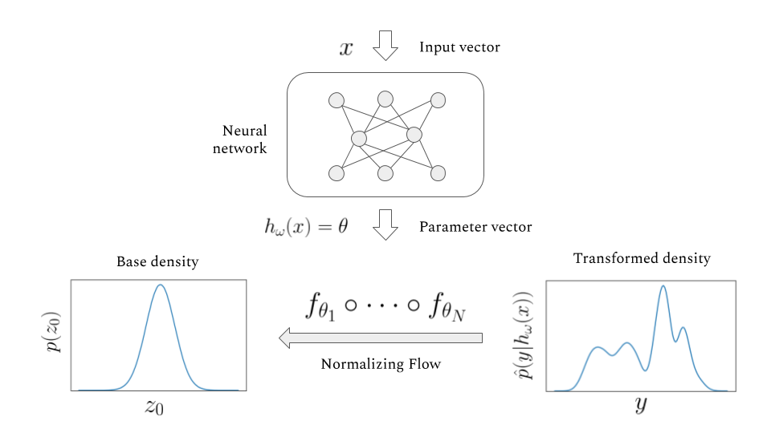

# (Bayesian) Normalizing Flow Network
A Normalizing Flow based model for Conditional Density Estimation.

More info about the NFN: [paper](https://arxiv.org/abs/1907.08982), [blog post](https://siboehm.com/articles/19/normalizing-flow-network)

## This repo implements:
### Conditional Density Estimators: 
- Normalizing Flow Network (NFN)
- Mixture Density Network (MDN)
- Kernel Mixture Network (KMN)
### Normalizing Flows
- Radial Flow
- Planar Flow
- Affine Flow


## Installing dependencies
Tested with Python version 3.8.
```bash
pip install -r requirements.txt
pip install -e .
# Only necessary for running the evaluation scripts, not necessary for development
pip install --no-dependencies cde
```
## Running tests
Tests are implemented using pytest
```bash
# run full test suit
pytest tests/
# run tests without the slow integration tests
pytest tests/ -m "not slow"
```
